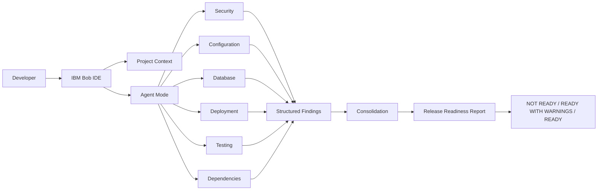

<div align="center">

# 🔎 ForensiX-ZR

### Release Readiness & Security Audit Assistant

**From Findings to Safer Releases**

[](https://www.ibm.com/)
[](https://www.python.org/)
[](https://fastapi.tiangolo.com/)
[](https://www.docker.com/)
[](https://github.com/features/actions)
[](https://pytest.org/)

<br>


<br>

[🚀 Live Demo](https://orensi.vercel.app/) •
[💻 GitHub Repository](https://github.com/zainab021/ForensiX-ZR) •
[📘 Hackathon Documentation](HACKATHON.md) •
[🤖 Bob Workflow](docs/bob-workflow.md) •
[📊 Audit Reports](reports/release-readiness-report.md)


</div>

---

## ✨ Project Highlights

| 🤖 IBM Bob Orchestration | 🔍 Evidence-Based Auditing | 🛡️ Security Analysis |
|---|---|---|
| Project Context + Agent Mode | Deterministic findings | Auth, secrets & access checks |

| ⚙️ Configuration | 🗄️ Database | 🐳 Deployment |
|---|---|---|
| Environment, CORS & hosts | PostgreSQL, SQLite & Alembic | Docker, CI/CD & HTTPS readiness |

| 🧪 Testing | 📦 Dependencies | 📊 Reporting |
|---|---|---|
| Live pytest execution | pip-audit integration | Markdown + JSON evidence |

---

## 📌 Overview

**ForensiX ZR Unit** is a role-based crime analysis and incident management system for digital crime reporting, investigation tracking, evidence management, and officer collaboration.

For the **IBM Bob 2.0 Hackathon**, this repository is also the target codebase for the **Release Readiness & Security Audit Assistant**. The hackathon solution focuses on improving a developer workflow: turning a repetitive, manual release-readiness review into a structured, evidence-backed audit process.

---

## 🎯 The Developer Problem

Release-readiness checking is often performed manually:

```text
README checklist
      ↓
Open configuration files
      ↓
Inspect authentication/security code
      ↓
Check database and migrations
      ↓
Run tests
      ↓
Check dependencies
      ↓
Check deployment configuration
      ↓
Make a release decision
```

This workflow requires developers to inspect many files, remember many checks, and repeat the process after changes. The goal of this project is to make the workflow **repeatable, evidence-backed, and easier to verify**.

---

# 🤖 IBM Bob 2.0 Hackathon Solution

## Frontend


## Product

### Release Readiness & Security Audit Assistant

The solution combines:

- **IBM Bob IDE** as the developer-workflow/orchestration layer
- **Project Context** for repository understanding
- **Agent Mode** for multi-step audit workflows
- Specialized audit tasks for different technical domains
- `scripts/release_check.py` as the deterministic audit engine
- Markdown and JSON reports for human and machine-readable results

### 🏗️ Solution Architecture



### High-Level Workflow

```text
Developer
    │
    ▼
IBM Bob IDE
    │
    ├── Security Audit
    ├── Configuration Audit
    ├── Database Audit
    ├── Deployment Audit
    ├── Testing Audit
    └── Dependency Audit
             │
             ▼
     Structured Findings
             │
             ▼
       Consolidation
             │
             ▼
   Release Readiness Report
             │
             ▼
 NOT READY / READY WITH WARNINGS / READY
```

IBM Bob provides the orchestration and developer interaction layer, while the Python audit engine provides deterministic, evidence-based checks.

---

# 🔎 What the Audit Checks

## 1. Security

Examples include:

- Secret and configuration exposure
- JWT configuration
- Password hashing
- OTP verification
- Authentication and authorization
- Demo-account configuration
- Evidence/file access
- CORS and security configuration

## 2. Configuration

Checks include:

- Environment variables
- API configuration
- CORS origins
- Allowed hosts
- Production configuration requirements
- Development versus production settings

## 3. Database

Checks include:

- Database URL configuration
- SQLite fallback behavior
- PostgreSQL configuration
- Alembic migrations
- Schema-management strategy
- Migration-related conflicts

## 4. Deployment

Checks include:

- Dockerfile
- Docker Compose
- Entrypoint and migrations
- CI/CD configuration
- HTTPS/TLS documentation
- Deployment readiness

## 5. Testing

Checks include:

- Test suite discovery
- Pytest execution
- Test failures/errors
- Test-related warnings

## 6. Dependencies

Checks include:

- Dependency-audit availability
- `pip-audit` execution
- Known dependency advisories
- Production/test dependency separation

---

# 📊 Evidence-Based Reporting

The audit engine generates:

```text
reports/
├── release-readiness-report.md
└── release-readiness-report.json
```

### Markdown Report

The Markdown report provides:

- Executive summary
- Audit timestamp
- Repository information
- Overall release status
- Findings by category
- Severity and confidence
- Evidence and affected locations
- Remediation guidance
- Passed checks
- Verification information

### JSON Report

The JSON report provides structured findings that IBM Bob can interpret and consolidate.

Example:

```json
{
  "id": "DEPLOY-CI",
  "category": "Deployment",
  "severity": "HIGH",
  "status": "CONFIRMED",
  "title": "No CI/CD pipeline configuration found",
  "evidence": "...",
  "remediation": "..."
}
```

The system is designed to **avoid invented CVEs, invented test results, or unsupported release claims**.

---

# 🚦 Release Status

The audit uses transparent release states rather than an arbitrary numerical score:

| Status | Meaning |
|---|---|
| `NOT READY` | A confirmed HIGH/CRITICAL issue or test failure blocks release |
| `READY WITH WARNINGS` | No blocking HIGH/CRITICAL issue remains, but warnings or verification items remain |
| `READY` | Automated checks pass without blocking findings |
| `NOT VERIFIED` | Required verification has not been performed |

---

# 🧠 IBM Bob Workflow

## Project Context

IBM Bob is provided with the repository as project context so it can understand:

- Application structure
- Audit scripts
- Documentation
- Backend and frontend files
- Configuration
- Existing reports
- Existing findings

This allows later tasks to build on the project context instead of repeatedly explaining the repository.

## Agent Mode

Agent Mode is used for multi-step release-readiness work such as:

1. Understanding the repository
2. Inspecting multiple files
3. Running tests/tools
4. Interpreting findings
5. Consolidating results
6. Guiding remediation
7. Re-running affected checks

## Specialized Audit Tasks

| Task | Focus |
|---|---|
| Security | Authentication, secrets, access control, evidence access |
| Configuration | Environment, CORS, API URLs, hosts |
| Database | Database configuration and migrations |
| Deployment | Docker, CI/CD, startup and deployment configuration |
| Testing | Pytest and test readiness |
| Dependencies | `pip-audit` and dependency advisories |

Independent audit areas can be handled as separate tasks and consolidated afterward.

---

# 📈 Workflow Impact

The intended improvement is to replace a repetitive manual review with a structured workflow:

| Before | After |
|---|---|
| Manual checklist | Structured audit workflow |
| Repeated file inspection | Repository Project Context |
| Sequential review | Independent specialized tasks |
| Human-only notes | Markdown + JSON evidence |
| Manual test verification | Optional live pytest execution |
| Manual dependency checking | Optional `pip-audit` execution |
| Re-read the full checklist after changes | Re-run affected checks |

> **Measurement note:** time-savings should only be presented as a measured benchmark after an actual before/after timing experiment. The workflow design itself does not prove a specific time reduction.

---

# 🧪 Verification

The backend test suite is located under:

```text
forensix_backend_python/tests/
```

During the IBM Bob workflow, the live test run reported:

```text
35 passed
0 failed
0 errors
```

The dependency audit also reported package advisories. These results are treated as tool-generated evidence and should be re-run after dependency changes.

---

# ⚠️ Remaining Audit Items

The following items have been remediated in this phase:

- ✅ CI/CD pipeline added (`.github/workflows/ci.yml`)
- ✅ Authenticated evidence file serving (`/api/evidence/files/<filename>`) replaces public `/uploads` static mount
- ✅ Dependency advisories addressed: `python-multipart` 0.0.20→0.0.32, `python-jose` 3.3.0→3.4.0
- ✅ `ALLOWED_HOSTS=*` documented — must be restricted to real domain(s) in production
- ✅ SQLite fallback with loud warning; `create_all()` skipped in PostgreSQL/production mode
- ✅ `VALID_OFFICER_CODES` is now a required env var (application will not start without it)
- ✅ JWT transmission through WebSocket URL query parameter — known browser WebSocket API limitation; token lifetime reduced to 30 minutes to limit exposure
- ✅ `.env` Git-tracking: `.env` is in `.gitignore` and not committed
- ✅ Password minimum raised from 6 to 8 characters (NIST SP 800-63B)

Remaining items requiring human verification:

- `ALLOWED_HOSTS` and `CORS_ORIGINS` must be configured to real domain values before production deployment
- HTTPS/TLS must be configured at the reverse-proxy layer (not handled by the application itself)
- ecdsa transitive dependency (via python-jose) — no fully fixed version exists; upgrading python-jose to 3.4.0 is the primary mitigation

---

# 🛠️ Quick Start

## Backend Setup

From the repository root:

```bash
cd forensix_backend_python
python -m venv venv
```

### Windows

```bash
venv\Scripts\activate
```

### Install dependencies

```bash
pip install -r requirements.txt
```

Create the local environment file:

```bash
copy .env.example .env
```

Configure the required values in `.env`.

### Start the backend

```bash
uvicorn app.main:app --reload
```

Backend:

```text
http://127.0.0.1:8000
```

Swagger:

```text
http://127.0.0.1:8000/docs
```

---

# 🧪 Run Tests

From `forensix_backend_python`:

```bash
# Install test dependencies (includes pytest and httpx)
pip install -r requirements-dev.txt
pytest
```

Or run directly:

```bash
python -m pytest --tb=short -q
```

---

# 🔍 Run the Release Audit

Run from the repository root.

### Static audit

```bash
python scripts/release_check.py
```

### Full audit

```bash
python scripts/release_check.py --run-tests --run-pip-audit
```

Reports are written to:

```text
reports/
```

---

# 🐳 Docker Deployment

Start the stack with:

```bash
docker compose up --build
```

The deployment configuration includes:

- PostgreSQL
- FastAPI backend
- Frontend
- Alembic migration entrypoint

The production database should be PostgreSQL and should be configured through `DATABASE_URL`.

---

# 🔐 Production Configuration

Before deployment, configure at minimum:

- A strong random `SECRET_KEY` (64+ hex chars)
- A production `DATABASE_URL` (PostgreSQL)
- `SEED_DEMO_USERS=false` (default — do not change in production)
- Real `CORS_ORIGINS` matching your frontend domain
- Restricted `ALLOWED_HOSTS` set to your domain(s)
- `VALID_OFFICER_CODES` with real internal codes (**required — application will not start without this**)
- SMTP credentials if password-reset email delivery is required
- `ACCESS_TOKEN_EXPIRE_MINUTES=30` (default) or adjust to your UX needs
- HTTPS/TLS at the deployment layer (nginx, Caddy, AWS ALB, etc.)

Do not commit `.env` or real secrets to the repository.

> **Note:** Port 8000 should not be directly internet-exposed in production.
> Place the backend behind an HTTPS reverse proxy.

---

# 👥 Application Roles

## Citizen

- Submit crime reports
- Upload evidence
- Track submitted reports
- View notifications
- Manage profile

## Officer / Admin

- Review reports
- Convert reports into cases
- Assign officers
- Manage evidence
- View activity logs
- Create notifications
- Monitor dashboards and analytics

---

# 🔐 Application Security Features

The application includes:

- JWT authentication
- Role-based access control
- bcrypt password hashing
- Officer-code verification
- OTP password reset
- Rate limiting
- Activity logging
- Evidence upload validation
- Protected frontend routes
- Password confirmation for sensitive actions

---

# 🗂️ Project Structure

```text
ForensiX-ZR-main/
│
├── frontend/
│   ├── authorized/
│   ├── unauthorized/
│   ├── css/
│   ├── js/
│   └── index.html
│
├── forensix_backend_python/
│   ├── app/
│   │   ├── models/
│   │   ├── routes/
│   │   ├── schemas/
│   │   ├── utils/
│   │   └── main.py
│   ├── alembic/
│   ├── tests/
│   ├── uploads/
│   └── requirements.txt
│
├── scripts/
│   └── release_check.py
│
├── reports/
│   ├── release-readiness-report.md
│   └── release-readiness-report.json
│
├── docs/
│   └── bob-workflow.md
│
├── bob_sessions/
│   └── Bob task evidence screenshots
│
├── HACKATHON.md
├── docker-compose.yml
└── README.md
```

---

# 🔄 Application Workflow

```text
Citizen Report
      ↓
Officer Review
      ↓
Assign Officer
      ↓
Convert to Case
      ↓
Evidence Linking
      ↓
Investigation Tracking
```

---

# 📚 Hackathon Documentation

- [`HACKATHON.md`](HACKATHON.md) — full hackathon solution and workflow
- [`docs/bob-workflow.md`](docs/bob-workflow.md) — IBM Bob architecture, prompts, tasks, and consolidation process
- [`bob_sessions/README.md`](bob_sessions/README.md) — Bob session evidence guide
- [`reports/release-readiness-report.md`](reports/release-readiness-report.md) — human-readable audit report
- [`reports/release-readiness-report.json`](reports/release-readiness-report.json) — machine-readable audit data

---

# 🎬 IBM Bob Demo Flow

For the hackathon demonstration:

1. Open the ForensiX-ZR repository in IBM Bob IDE.
2. Show Project Context understanding.
3. Use Agent Mode for the release-readiness workflow.
4. Show the specialized audit tasks.
5. Show security, configuration, database, deployment, testing, and dependency findings.
6. Show the consolidated release-readiness result.
7. Open the generated Markdown/JSON report.
8. Select a finding and show its evidence and remediation.
9. After a fix, re-run the affected audit.
10. Show how the release status changes after verified remediation.

The demo should distinguish **actual tool output** from estimates or planned improvements.

---

# 📸 Bob Session Evidence

Bob task evidence is stored in:

```text
bob_sessions/
```

The folder contains screenshots documenting the completed Bob workflow tasks required for the hackathon submission.

---

# 🟡 Final Verified Audit

> **READY WITH WARNINGS**

The final live audit was executed with:

```bash
python scripts/release_check.py --run-tests --run-pip-audit
```

| Result | Verified Evidence |
|---|---:|
| Confirmed findings | **0** |
| Checks passed | **23 / 27** |
| Warnings | **2** |
| Not verified | **2** |
| Pytest | **35 / 35 passed** |
| CI/CD | **GitHub Actions workflow present** |

### Remaining non-blocking warnings

| ID | Severity | Finding |
|---|---|---|
| `CONFIG-03` | MEDIUM | `ALLOWED_HOSTS=*` in `.env.example`; production must use restricted hosts |
| `SEC-04` | LOW | JWT passed through the WebSocket query parameter |

The final status is based on live tool evidence. The dependency audit still reports transitive `pyasn1` and `ecdsa` advisories; this README does **not** claim that all dependency vulnerabilities are eliminated.

---

# 🔄 Before → After

| Before IBM Bob Workflow | After IBM Bob Workflow |
|---|---|
| Manual checklist | Structured audit workflow |
| Repeated file inspection | Repository Project Context |
| Sequential review | Specialized audit tasks |
| Manual notes | Markdown + JSON evidence |
| Manual dependency checking | `pip-audit` |
| Re-read checklist after changes | Re-run affected checks |

> **Measurement note:** no specific time-savings figure is claimed because a formal before/after timing benchmark was not performed.

---

# 📸 IBM Bob Session Evidence

The repository contains screenshots documenting the actual IBM Bob workflow:

| Task | Evidence |
|---|---|
| Task 01 | Repository Analysis |
| Task 02 | Security Audit |
| Task 03 | Configuration Audit |
| Task 04 | Database Audit |
| Task 06 | Testing & Dependency Audit |
| Task 07 | Final Consolidation |
| Task 08 | Final Release Audit |

See [`bob_sessions/`](bob_sessions/) for the session evidence.

---

# 👥 Team CodeFlow

| Member | Contribution |
|---|---|
| **Saqib Azair** | Development / IBM Bob Workflow |
| **Zainab** | Original Application / Project |
| **Areeha** | Technical/Documentation |

**Team CodeFlow** built the IBM Bob 2.0 Hackathon solution around the ForensiX-ZR codebase.

---

# 🔗 Quick Navigation

<div align="center">

[🚀 Live Demo](https://orensi.vercel.app/) •
[💻 GitHub](https://github.com/zainab021/ForensiX-ZR) •
[📘 HACKATHON.md](HACKATHON.md) •
[🤖 Bob Workflow](docs/bob-workflow.md) •
[📊 Markdown Report](reports/release-readiness-report.md) •
[🧾 JSON Report](reports/release-readiness-report.json)

</div>

---

# ⚠️ Limitations

The audit engine is intentionally transparent about limitations:

- Static analysis cannot prove every runtime security property.
- External TLS/load-balancer configuration may require human verification.
- Pattern-based checks can miss unusual or obfuscated configurations.
- Dependency scanning depends on `pip-audit` being available and executed.
- Git-tracking checks depend on repository/Git state being accessible.
- Current check IDs and patterns are tailored to ForensiX-ZR.
- The implementation does not use an internal IBM Bob SDK/API; Bob acts as the developer-workflow/orchestration layer while the audit engine runs as a repository tool.

---

# 🚀 Future Enhancements

- GitHub Actions CI/CD integration
- Automated dependency scanning in CI
- Authenticated evidence-file serving
- Stronger production configuration enforcement
- Container/image vulnerability scanning
- Migration-only schema management
- Automated re-audit after code changes
- Reusable audit rules for additional repositories

---

# 📄 Project Credits

**ForensiX ZR Unit** — original application codebase.

For the IBM Bob 2.0 Hackathon, **Team CodeFlow** built the Release Readiness & Security Audit Assistant around this codebase.

---

# 📄 License

This project is developed for educational and portfolio purposes.
